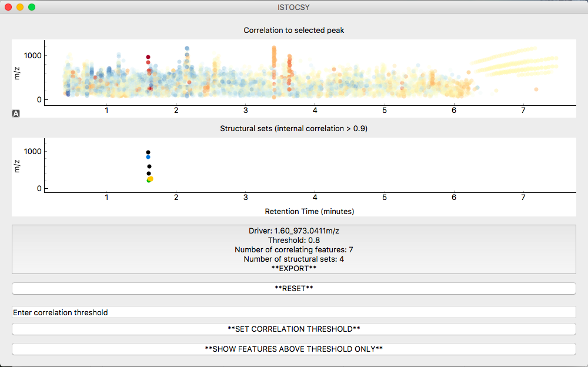

=========================
Introduction to ISTOCSY
=========================

ISTOCSY is a python library for interactively exploring the correlations between features in mass spectrometry datasets.

Introduction to the main panels
===============================

The ISTOCSY window consists of three main panels and a drop down menu.

- Panel 1 (top): A plot of the correlations

- Panel 2 (middle): The structural sets

- Panel 3 (bottom): Buttons

- Menu (accessed at the top left corner)

Correlation plot functionality
==============================

Once data has been imported, the top plot shows a map of all of the features in the data set, by retention time (X axis) and mass/charge ratio (Y axis).

Hovering the mouse pointer over each feature shows the feature name.

Left clicking and dragging over an area functions to zoom in on this region. A single left mouse click on a region with no features resets the zoom.

Left clicking on a feature sets this feature as the driver, and correlations are calculated from this feature to all others in the data set. This plot is then updated and each feature is coloured by the correlation to the given driver peak. The correlations are shown on a colour scale of red to blue, where red points are strongly positively correlated and blue points are more negatively correlated.

Structural set functionality
============================

Initially, the bottom plot (similar to the top plot) shows a map of all the features in the data set. 

Once a driver feature is clicked, the bottom plot is updated to show ‘structural sets’ within the data set. Now only features correlating to the driver feature above the correlation threshold are shown. Internal correlations are calculated within this subset of features, and any features which internally correlate with each other above the structural threshold (default 0.9) and within a set retention time window (default None) are shown in the same colour, making it easy to determine which features are likely resulting from the same original compound in the sample.

Hovering the mouse pointer over a feature in the bottom plot shows the number of the structural set in the top plot.

Button functionalities
======================

The bottom panel allows the user a number of different functions.

- *EXPORT*
	This button displays the parameters used (driver feature; correlation threshold etc.) alongside a summary of the results (number of correlating features; number of structural sets). Clicking on this button exports a csv file of the results and a screenshot of the ISTOCSY window.

- *RESET*
	Clicking on this button resets ISTOCSY to show all features so a new driver feature can be selected.

- *SET CORRELATION THRESHOLD*
	Once a correlation threshold (between -1 and 1) has been entered in the text box above, clicking on this button sets the correlation to this value and updates ISTOCSY.

- *FEATURE VIEW*
	Clicking on this button toggles between showing all features in the top window, and just those features which correlate to the driver feature above the correlation threshold.
	
	
Menu functionalities
====================

The menu bar consists of three sub-menus.

- *File*
	In the file menu, the user can set the path to the data files (intensity data/feature data/nPYc dataset) and import the data; set the directory in which outputs will be saved; and exit the app.
	 
- *Settings*
	In the settings menu, the current settings can be displayed; or each parameter changed according to the user's requirements.
	
- *Display*
	The options in the display menu result in interactive html (plotly) figures being generated and saved to the save directory.
