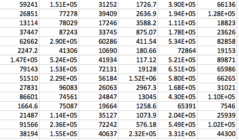
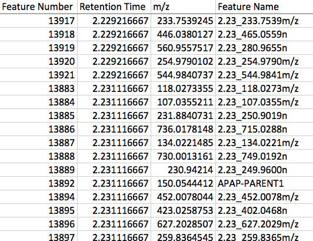

============================
System and data requirements
============================

This page details the data and system requirements and the setup for running ISTOCSY.

System requirements
===================

ISTOCSY runs in Python.

To see the list of required libraries see setup.py

Data requirements
=================

ISTOCSY can work with data input in one of two ways; either in csv file format; or as an nPYc dataset object.

Format 1: csv file format
=========================

If using the csv file format, two csv files are required. 

1. intensity data file: this file should contain numerical data only, of ns*nv dimensions, where ns is the number of samples (rows in the matrix) and nv the number of variables (columns in the matrix) i.e., the intensities of nv features across ns samples.

2. feature metadata file: as a minimum, this file should contain 3 columns and nv + 1 (header) rows. After the column headers, each row should give information on the corresponding variable in the intensity data file, and the 3 columns must consisit of 'Feature Name' (str) name of the feature; 'Retention Time' (number) feature retention time; 'm/z' (number) mass of the feature. Note the columns in the feature metadata must have these exact headers for the information to be extracted.

Example excerpt from the intensity data file:

Example excerpt from the feature metadata file:

Format 2: nPYc dataset object format
====================================

If using the nPYc dataset object format only the object itself is required (for details see https://github.com/phenomecentre/nPYc-Toolbox)

