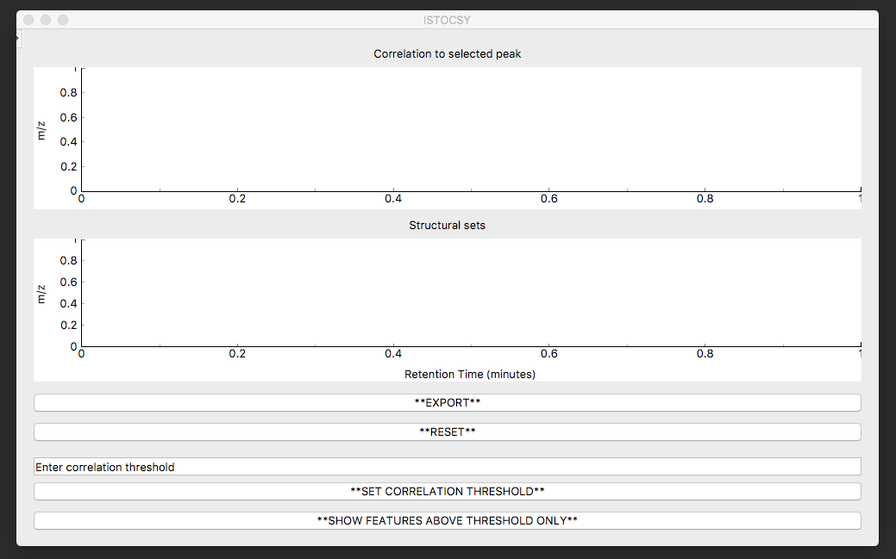
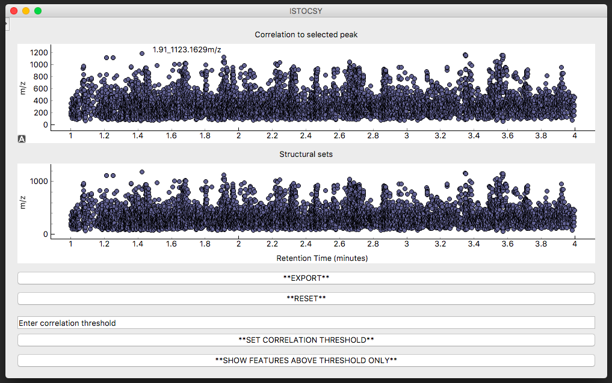

========
Tutorial
========

This document provides a description of how to use ISTOCSY. Note, all code snippets should be run from a Python terminal.

Installing ISTOCSY
==================

For details on importing the ISTOCSY code see https://github.com/phenomecentre/ISTOCSY

Running ISTOCSY
===============

ISTOCSY can either be run directly from a console:

.. code-block: python
	
	ISTOCSY
	
Or, from a python terminal:

.. code-block: python

	import pyIstocsy
	pyIstocsy.runISTOCSY()
	
Either of these result in the opening of an ISTOCSY window:

	

Importing Data
==============

Using the File menu, the path to the intensity data and feature metadata files can be set, then the data imported using File>Import Data.

At this point, the save directory can also be defined using File>Change save directory (NOTE this is optional - the default is to save in current working directory).

On importing data, the plots windows will be populated and you can begin to explore the correlations in your dataset.

For a detailed description of the attributes of each panel see:
:ref:`Introduction to ISTOCSY`

Running ISTOCSY with a selected driver feature
==============================================

Hovering over the features in the top plot gives their figure names. Left clicking on one your feature of choice (here, for example, on feature ‘1.60_973.0411m/z’) will then update ISTOCSY as follows.

	
Now the top plot window shows the correlations to all the features, and the lower plot window the structural sets within these correlated features.
	

Toggling between 'all' and 'above threshold' features in the correlation plot
=============================================================================

In the correlation plot (top panel), once a driver peak has been selected, you can either show all the features in the data set (coloured by correlation to driver, alpha set to reflect the strength of correlation), or, just those which correlate to the driver above the correlation threshold.

Toggling between these two viewing options can be achieved by clicking on the bottom button which will display '**SHOW FEATURES ABOVE THRESHOLD ONLY**' or '**SHOW ALL FEATURES**' depending on current view selected.

Showing all features:

Showing only those features above threshold: <CAZ ADD THIS>

	

Changing the correlation threshold
==================================

The correlation threshold above which correlations to the driver feature will be shown can be changed by entering a value between -1 and 1 into the text box 'Enter correlation threshold' and clicking the '**SET CORRELATION THRESHOLD**' button below.

For example, to change the threshold from the default (0.8) to 0.7:
<ADD THIS>

This will update ISTOCSY as follows:
<ADD THIS>

Exporting
=========

The *EXPORT* button button displays the parameters used (driver feature; correlation threshold etc.) alongside a summary of the results (number of correlating features; number of structural sets). Clicking on this button exports a csv file of the results and a screenshot of the ISTOCSY window to the save directory.

Example csv file output:
<ADD THIS>
	
	
Changing the driver feature
===========================

To select a different driver feature from which to run ISTOCSY, you can simply left click on the required feature in the top plot window. If this feature is not visible (owing to a low correlation and thus a low alpha with a pre-selected driver peak), first clicking on the *RESET* button will set the ion map windows back to show all features.

Changing other paramters using the menu bar
===========================================

Using the Settings menu, other parameters for correlation, FDR correction and definition of structural sets can be amended. Changing any of these will result in the plot being updated. 

For example,

<ADD THIS>
	

Displaying/exporting html versions of figures
=============================================

<ADD THIS>

