========
Tutorial
========

This document provides a description of how to use ISTOCSY. Note, all code snippets should be run from a Python terminal.

Installing ISTOCSY
==================

For details on importing the ISTOCSY code see https://github.com/phenomecentre/ISTOCSY

Running ISTOCSY
===============

ISTOCSY can either be run directly from a console:

.. code-block:: python
	
	ISTOCSY
	
Or, from a python terminal:

.. code-block:: python

	import pyIstocsy
	pyIstocsy.runISTOCSY()
	
Either of these result in the opening of an ISTOCSY window:

.. figure:: _static/openingScreen.png
	:figwidth: 90%
	:alt: ISTOCSY opening screen
	

Importing Data
==============

Using the File menu, the path to the intensity data and feature metadata files can be set, then the data imported using File>Import Data.

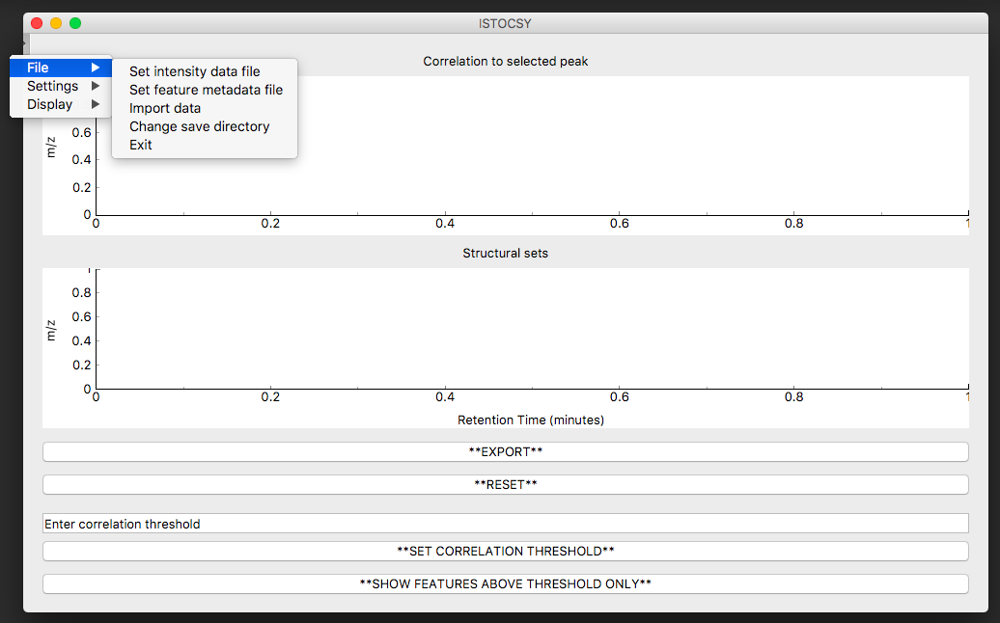

At this point, the save directory can also be defined using File>Change save directory (NOTE this is optional - the default is to save in current working directory).

On importing data, the plot windows will be populated as below, and you can begin to explore the correlations in your dataset.

.. figure:: _static/hover.png
	:figwidth: 90%
	:alt: ISTOCSY data imported

For a detailed description of the attributes of each panel see:
:ref:`Introduction to ISTOCSY`

Running ISTOCSY with a selected driver feature
==============================================

Hovering over the features in the top plot gives their figure names. 

.. figure:: _static/hover.png
	:figwidth: 90%
	:alt: ISTOCSY hover

Left clicking on a feature will set this as the driver feature, and update ISTOCSY to this effect. For example, driving from APAP-PARENT1 (a feature of parent paracetamol ion), would result in the following:

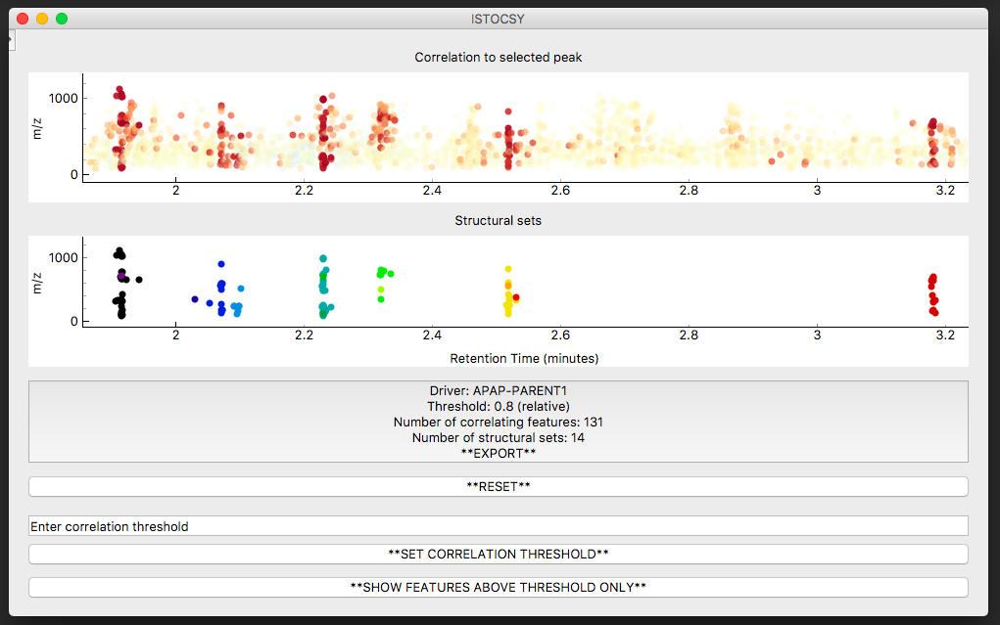
	
Now the top plot window shows the correlations to all the features, and the lower plot window the structural sets within these correlated features.

If the name of the driver feature required is known, ISTOCSY can similarly be initiated by entering this feature name into the Settings>Set driver pop up window. For example:

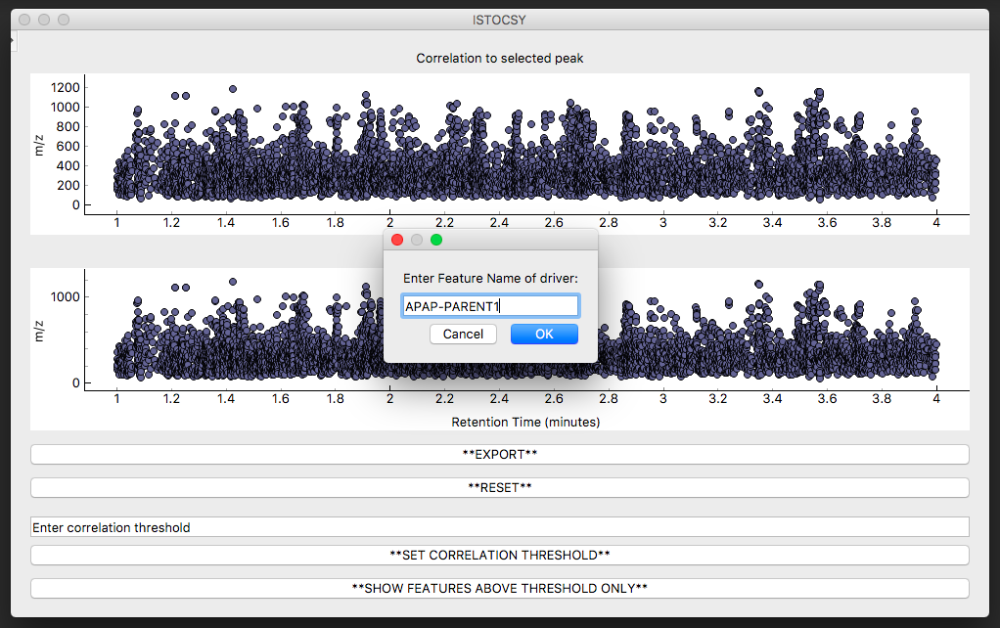
	

Toggling between 'all' and 'above threshold' features in the correlation plot
=============================================================================

In the correlation plot (top panel), once a driver peak has been selected, you can either show all the features in the data set (coloured by correlation to driver, alpha set to reflect the strength of correlation), or, just those which correlate to the driver above the correlation threshold.

Toggling between these two viewing options can be achieved by clicking on the bottom button which will display '**SHOW FEATURES ABOVE THRESHOLD ONLY**' or '**SHOW ALL FEATURES**' depending on current view selected.

Showing only those features above threshold:

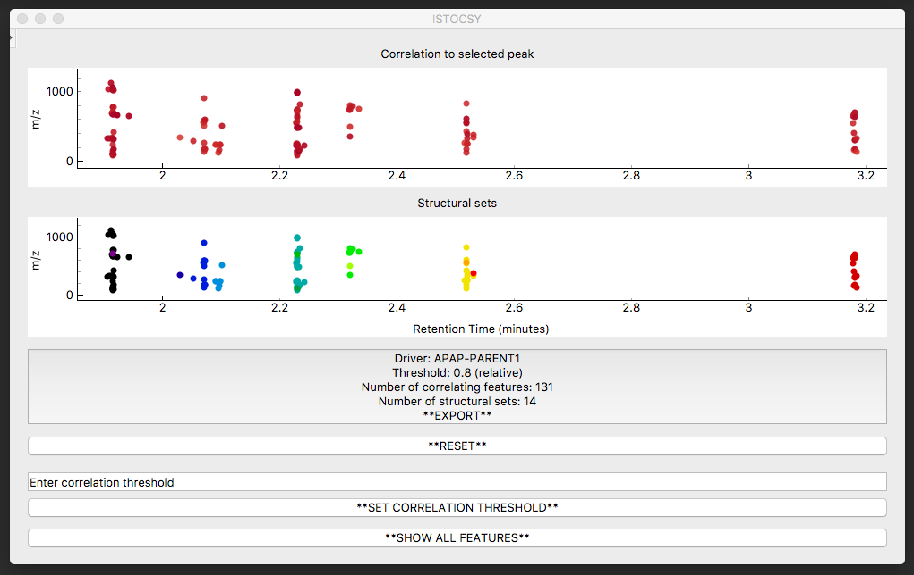
	
Toggle to show all features:

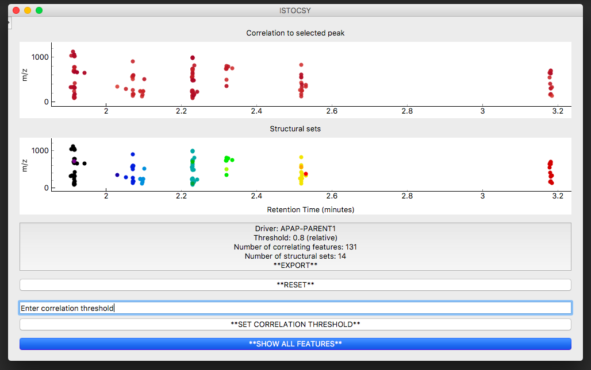

Showing all features:

	

Changing the correlation threshold
==================================

The correlation threshold above which correlations to the driver feature will be shown can be changed by entering a value between -1 and 1 into the text box 'Enter correlation threshold' and clicking the '**SET CORRELATION THRESHOLD**' button below.

For example, to change the threshold from the default (0.8) to 0.6 would update the output as follows:

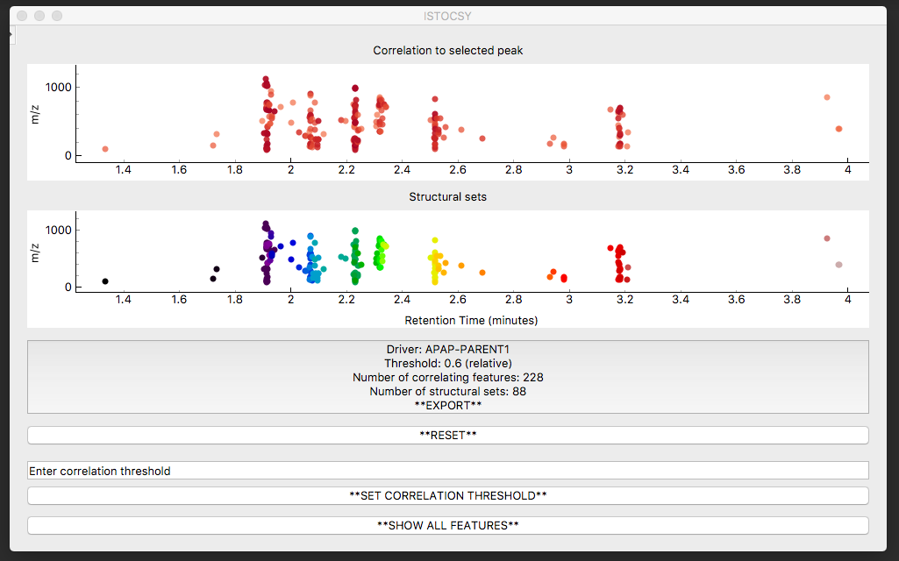

Exporting
=========

The *EXPORT* button button displays the parameters used (driver feature; correlation threshold etc.) alongside a summary of the results (number of correlating features; number of structural sets). Clicking on this button exports a csv file of the results and a screenshot of the ISTOCSY window to the save directory.

Example csv file output:

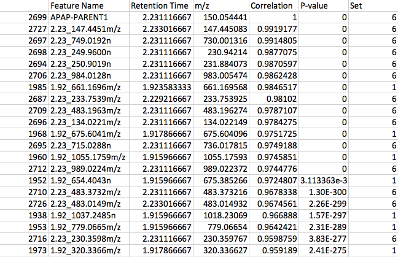
	
This file contains one row per feature correlating with the driver above the correlation threshold. Alongside columns containing 'Feature Name', 'Retention Time' and 'm/z' (from the original feature metadata); this file contains the correlation coefficient between each feature and the driver ('Correlation'), the corresponding P-value ('P-value'), and multiple test corrected ('Q-value') if multiple testing correction method set (see settings menu section below), and finally the putative structural set ('Set') between which features share a high correlation and retention time window (see settings memu section below).

	
Changing the driver feature
===========================

To select a different driver feature from which to run ISTOCSY, you can simply left click on the required feature in the top plot window. If this feature is not visible (owing to a low correlation and thus a low alpha with a pre-selected driver peak), first clicking on the *RESET* button will set the ion map windows back to show all features.

Changing other paramters using the settings menu
================================================

The current values of all settable parmaters can be displayed using Settings>Current settings:

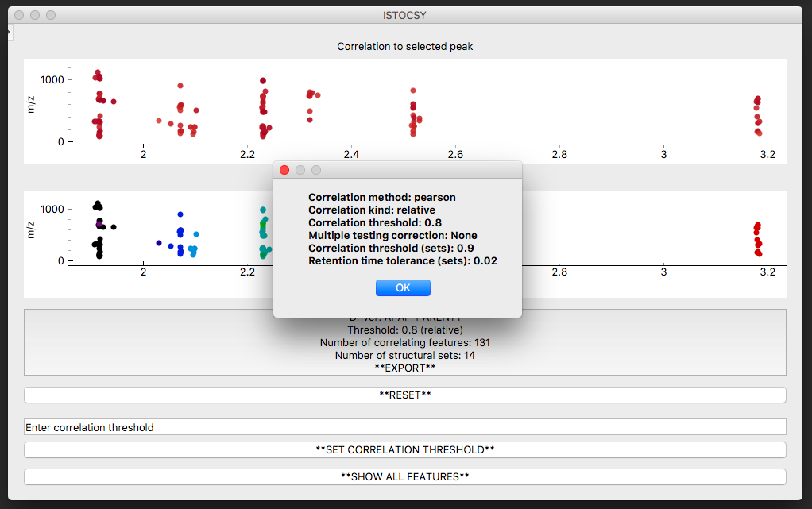

Using the Settings menu, other parameters for example, for correlation, FDR correction and definition of structural sets can be amended.

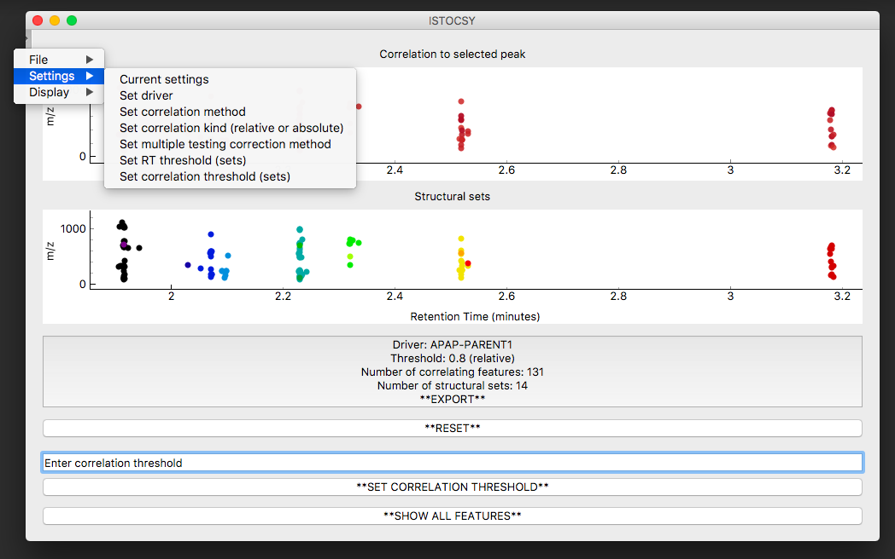

Those which relate the features found to be correlating to the driver feature include:

- 'Set correlation method': allows the user to set the method, Pearson, Spearman or Kendal's Tau.
- 'Set correlation kind (relative or absolute)': allows the user to explore either only those features correlating above the threshold (relative) or the absolute correlation, so both positively and negatively correlated features will be displayed.

Changing any of these will result in ISTOCSY being updated. 

In addition, while 'Set multiple testing correction method' does not visually update the results, it leads to an additional column in the CSV output which contains the q-value (multiple testing corrected p-value) by the method selected, for each feature correlating about the threshold.

The final pair of settable parameters relate to how correlating features are partitioned into putative structural sets:

- 'Set RT threshold (sets)': allows the user to change the Retention Time window between which two features are allowed to be in the same set.
- 'Set correlation threshold (sets)': aloows the user to change the correlation value which must be attained before two features are allowed to be in the same structural set.

Again, changing either of these will result in ISTOCSY being updated. 
	

Displaying/exporting plotly versions of figures using the display menu
======================================================================

Interactive plotly versions of figures can also be created (and again automatically saved to the output directory) using the display menu. These are useful for both exploring the data and sharing with collaborators.

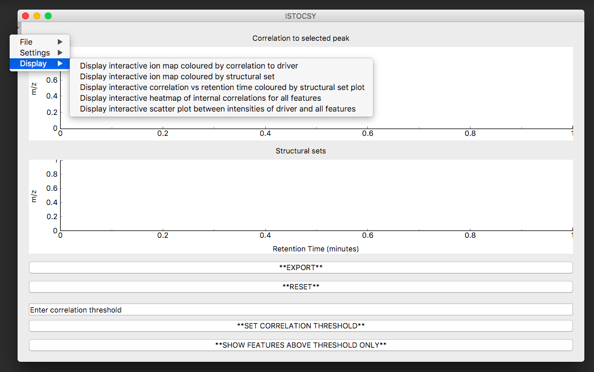
	
The plots available are:

An ion map coloured by correlation to driver (equivalent to the top plot in the main ISTOCSY window):

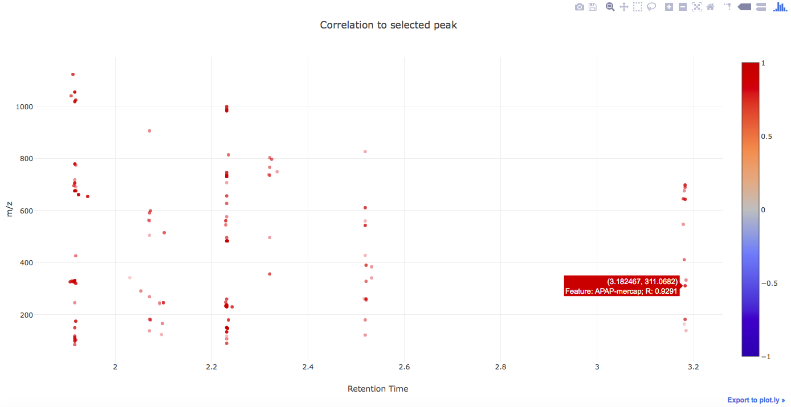

An ion map coloured by structural set (equivalent to the bottom plot in the main ISTOCSY window):

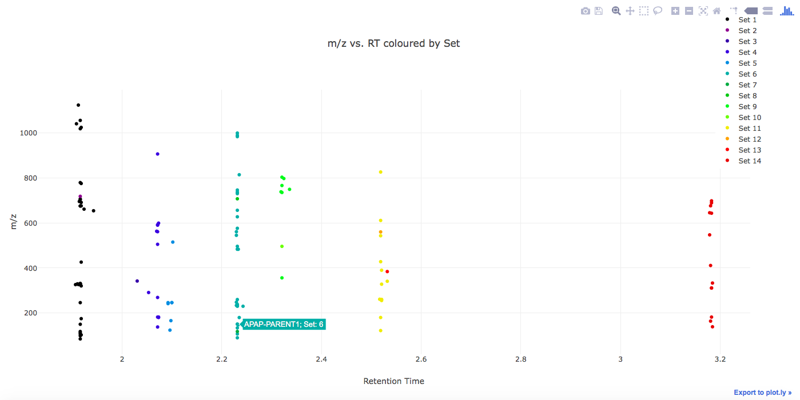

A plot of correlation vs. retention time coloured by structural set:

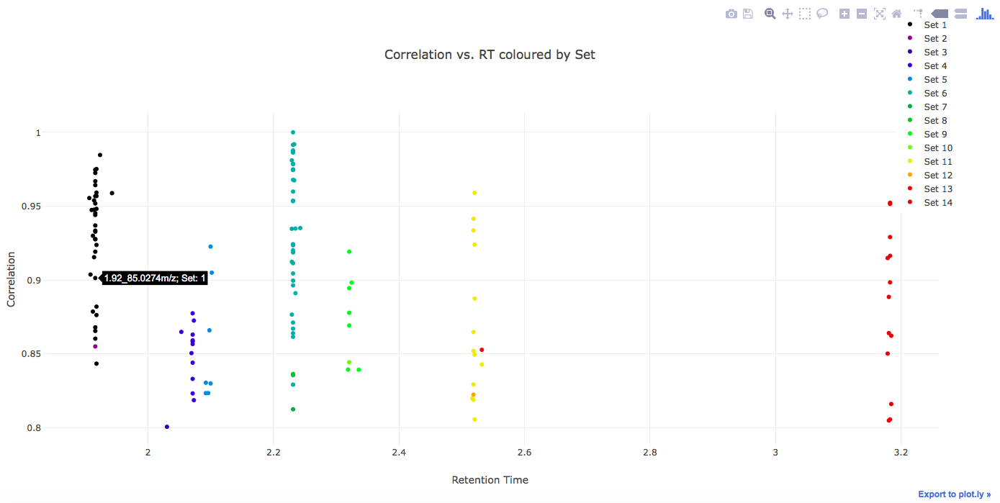

A heatmap of the internal correlations between all detected features:

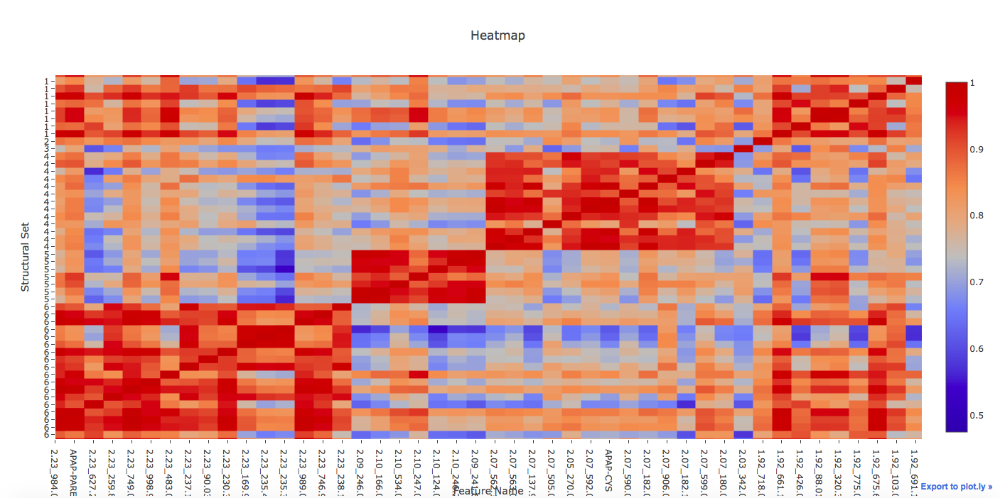

